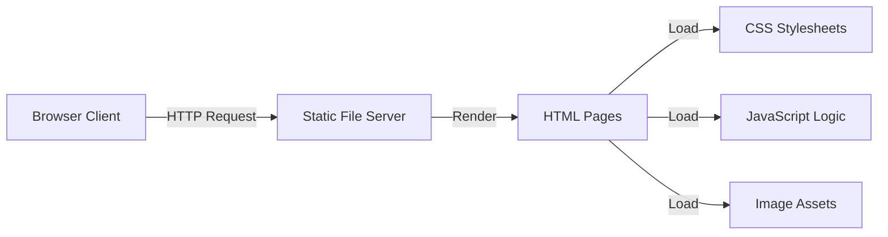

# MR.COFFEE


Aplikasi *landing page* dan *company profile* untuk kedai kopi premium. Dilengkapi dengan antarmuka yang sangat interaktif (menggunakan efek *glassmorphism* dan animasi *scroll*), halaman menu lengkap, hingga profil *founder* dan promo spesial.

## Daftar Isi

- [Fitur](#fitur)
- [Tech Stack](#tech-stack)
- [Arsitektur](#arsitektur)
- [Struktur Folder](#struktur-folder)
- [Environment Variables](#environment-variables)
- [Instalasi](#instalasi)
- [Catatan](#catatan)

## Fitur

**Pengunjung (User)**
- Menjelajahi beranda interaktif dengan *hero banner* elegan
- Melihat daftar kopi andalan (Most Ordered) yang dirender secara dinamis
- Navigasi mulus ke halaman Menu, Rewards, About Us, dan Order
- Pengalaman UI premium: efek *glassmorphism*, bentuk organik (*blob shape* pada profil), dan tombol bergaya *ghost-button*
- Animasi transisi *scroll-triggered* (elemen muncul perlahan saat di-*scroll*)
- Tampilan responsif penuh (*mobile-friendly*) menggunakan *hamburger menu*

## Tech Stack

| Komponen | Teknologi |
|---|---|
| Frontend | HTML5 Semantic, CSS3 (Custom Variables), Vanilla JavaScript |
| Tipografi | Google Fonts (Poppins) |
| Layout & Animasi | Flexbox, CSS Grid, CSS Transitions/Keyframes, IntersectionObserver API |
| Ikonografi & Aset | Aset lokal dioptimalkan (JPG/PNG) |

## Arsitektur

Karena ini adalah *static web application*, arsitekturnya difokuskan pada pengiriman *asset* langsung ke klien tanpa *backend routing* yang kompleks:



## Struktur Folder

```
Website/
├── css/
│   ├── style.css         # Styling utama (variabel warna, glassmorphism, layout)
│   ├── responsive.css    # Media queries khusus resolusi tablet & mobile
│   ├── about.css         # Style khusus halaman About
│   ├── menu.css          # Style khusus halaman Menu
│   └── order.css         # Style khusus halaman Order
├── images/               # Semua aset gambar produk, logo, dan profil
├── js/
│   ├── main.js           # Logic navbar, scroll animations, dynamic product cards
│   ├── menu.js           # Logic interaktif di halaman menu
│   └── order.js          # Logic kalkulasi pesanan
├── pages/
│   ├── about.html        # Halaman profil founder & filosofi kopi
│   ├── menu.html         # Katalog lengkap varian kopi
│   ├── order.html        # Halaman form pemesanan
│   └── rewards.html      # Halaman kupon promo & membership
└── index.html            # Entry point / Landing Page utama
```

## Environment Variables

Proyek ini murni *Frontend Static* dan tidak terhubung ke API eksternal untuk saat ini, sehingga **tidak membutuhkan** file `.env`.

## Instalasi

Prasyarat: Web Browser modern (Chrome, Edge, Firefox, Safari).

```bash
# 1. Clone repository
git clone https://github.com/NAxel-code/Coffee-Shop-Website.git

# 2. Masuk ke direktori proyek
cd Coffee-Shop-Website

# 3. Jalankan server lokal (contoh menggunakan Python)
python -m http.server 8080
```

Website dapat diakses melalui `http://localhost:8080` di browser Anda. Alternatif lain, Anda dapat menggunakan ekstensi *Live Server* di VS Code atau sekadar klik ganda pada file `index.html`.

## Catatan

- **Manajemen Cache:** Jika Anda melakukan perubahan pada file CSS (seperti `style.css`) dan hasilnya tidak terlihat, pastikan untuk menggunakan fitur *hard refresh* (Ctrl + F5 / Cmd + Shift + R) atau *cache-busting* parameter (contoh: `style.css?v=2`) pada tag `<link>` HTML.
- **Dinamis via JS:** Data produk pada bagian "Most Ordered" di halaman beranda dihasilkan secara dinamis menggunakan struktur array di dalam `js/main.js`.
